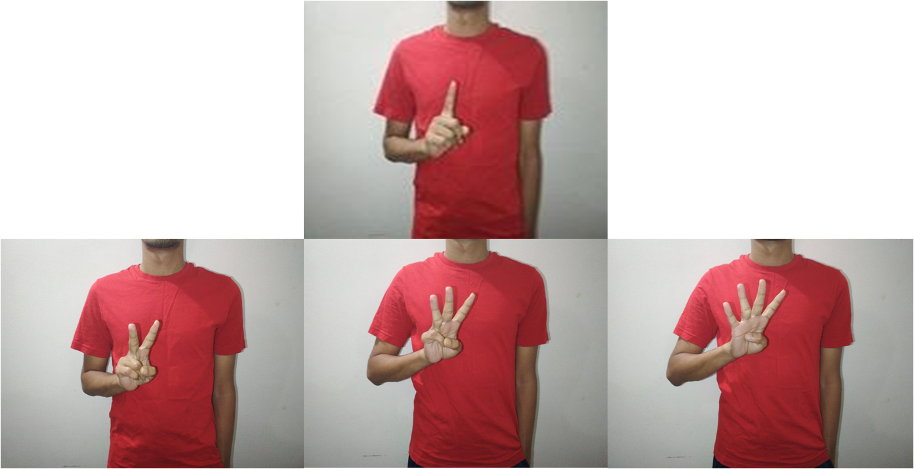
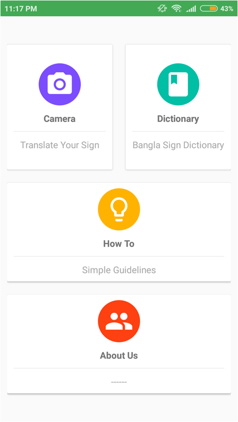
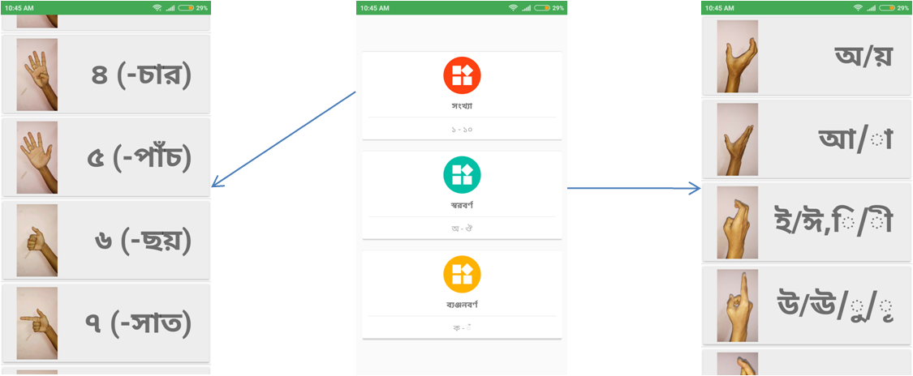
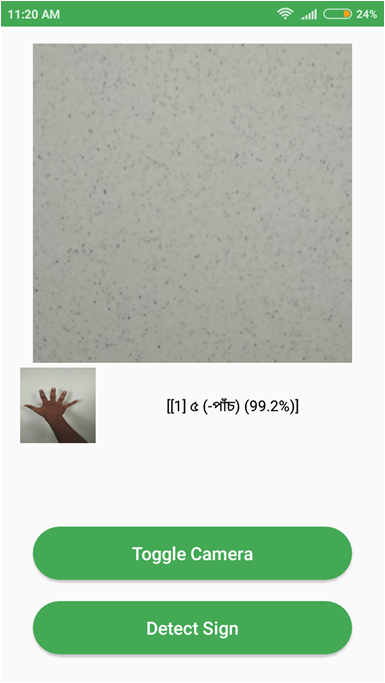

<h1 align="center">Sign-Language-Interpreter</h1>

<h2> This project is for detecting Bangla Sign Language, where Sign images were trained to a deep learning model and later on that model was used in an android app which can detect Sign Language from user input images. </h2>

<h2> We have collected 10 digits(1,2...) of data for training purpose.</h2>

    
     

<h2> We have used this images to train our deep learning model and later we used it on an android app. The android app has two part. One is Dictionary where each Bangla Sign is being introduced and another is detection where a user will input image taken real time by their smartphones and our android app will interpret the image into bangla text.</h2>
<h2 align="center">Android UserInterface</h2>

 
    
     

<h2 align="center">Android App Usage functionalities</h2>

 
    
     

<h2 align="center">Bangla Sign Detection</h2>

    
     

